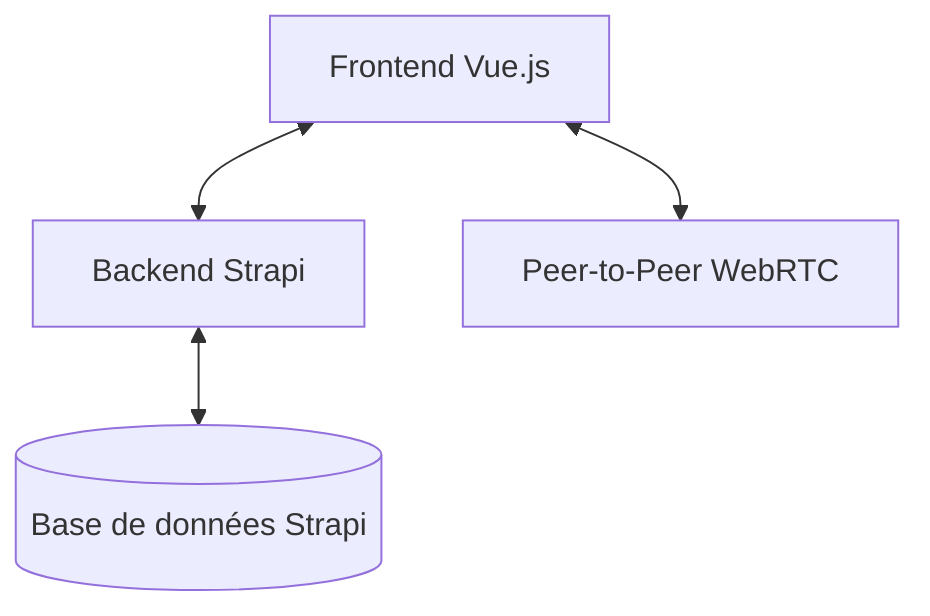

# Architecture Technique

Ce document décrit l'architecture globale du jeu **Terra Nullius** (Triple Triad).

## Vue d'ensemble de la Pile Technologique

Le projet est divisé en deux parties principales (monorepo) :
- **Frontend** : Application Vue.js 3 utilisant Vite pour le build.
- **Backend** : CMS Strapi (Node.js) pour la persistance des données et la logique métier sécurisée.

## Organisation du Code

### Frontend (`/front`)
- **`src/components/`** : Composants Vue UI (Cartes, Plateau, Ouverture de boosters).
- **`src/game/`** : Logique métier du jeu.
    - `state.js` : État réactif global (Vue `reactive`).
    - `GameEngine.js` : Moteur de calcul pur et immuable pour les mécaniques du Triple Triad.
    - `TurnManager.js` : Gestionnaire de tours et synchronisation (Local/Online).
    - `rules.js` : Registre des règles optionnelles (Same, Plus, Combo).
- **`src/stores/`** : Gestion d'état additionnelle (User, Notifications).

### Backend (`/back`)
- **`strapi/`** : Instance Strapi contenant les APIs pour :
    - Gestion des collections de cartes (`user-card`).
    - Ouverture de boosters (`booster`).
    - Historique des matches (`game-history`).
    - Arbitrage des parties en ligne (`match`).

## Flux de Données

1. **Persistance** : Les cartes possédées par l'utilisateur sont stockées dans Strapi.
2. **Temps Réel** : Les parties multijoueurs utilisent WebRTC pour une communication directe entre clients, avec une vérification périodique par le serveur (Arbitrage) en cas de désynchronisation.
3. **Réactivité** : Le frontend utilise l'API de réactivité de Vue 3 pour mettre à jour l'interface instantanément dès que `state.js` change.
