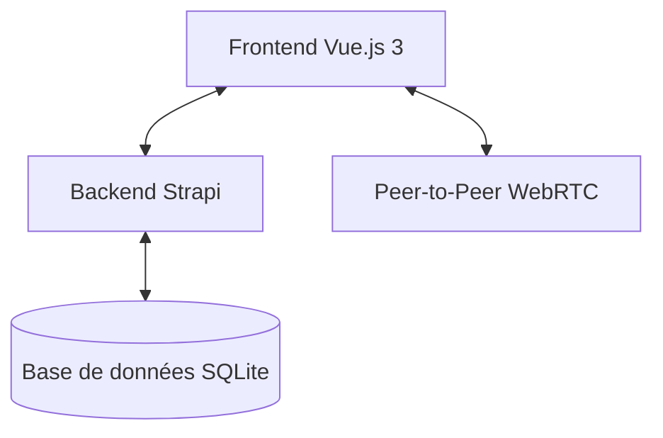

# Architecture Technique

Ce document décrit l'architecture globale du jeu **Terra Nullius** (Triple Triad).

## Vue d'ensemble de la Pile Technologique

Le projet est divisé en deux parties principales (monorepo) :
- **Frontend** : Application Vue.js 3 + Vite, utilisant la Composition API et Pinia pour la gestion d'état.
- **Backend** : CMS Strapi 5 (TypeScript) pour la persistance des données et la logique métier sécurisée.



## Organisation du Code

### Frontend (`front/src/`)

```
src/
├── api/                    # Communication avec le backend
│   ├── strapi.js          # Client API REST
│   └── strapiMock.js      # Mock pour développement hors-ligne
├── assets/                 # Ressources statiques
├── components/             # Composants Vue réutilisables
│   ├── TripleTriadCard.vue       # Carte de jeu (stats, éléments, rareté)
│   ├── TripleTriadCardGrid.vue    # Grille de cartes (collection, deck builder)
│   ├── GameBoard.vue             # Plateau 3x3
│   ├── PlayerHand.vue             # Main du joueur
│   ├── OpponentHand.vue           # Main de l'adversaire
│   ├── CoinToss.vue               # Animation lancer de pièce
│   ├── PackOpening.vue            # Animation ouverture de boosters
│   ├── AnimatedCardBack.vue        # Dos de carte animé
│   └── ...
├── game/                   # Moteur de jeu (Logique métier)
│   ├── state.js           # État réactif global (source唯一de vérité)
│   ├── GameEngine.js     # Moteur de calcul pur (captures, winner)
│   ├── TurnManager.js    # Gestionnaire de tours (Local/Online)
│   ├── WebRTCManager.js  # Communication P2P pour multijoueur
│   ├── ai.js             # Intelligence artificielle
│   ├── rules.js          # Règles optionnelles (Same, Plus, Combo, Elements)
│   ├── constants.js     # Constantes du jeu
│   ├── getNeighbors.js  # Utilitaires cases adjacentes
│   ├── game-actions.js   # Actions de jeu
│   ├── input.js          # Gestion des entrées utilisateur
│   ├── events.js         # Événements du jeu
│   └── logger.js         # Journalisation
├── stores/               # Gestion d'état Pinia
│   ├── userStore.js      # Données joueur, collection, decks, portefeuille
│   ├── notificationStore.js  # Notifications et alertes
│   └── layoutStore.js   # Gestion du layout dynamique
├── views/                # Pages de l'application
│   ├── MainMenu.vue              # Menu principal
│   ├── GameView.vue              # Écran de jeu
│   ├── CollectionView.vue        # Classeur de cartes
│   ├── DecksPage.vue             # Liste des decks
│   ├── DeckEditorPage.vue        # Éditeur de deck
│   ├── PackOpening.vue           # Boutique/Ouverture boosters
│   ├── StoryPage.vue             # Progression histoire
│   └── QuestsPage.vue            # Quêtes
├── router/               # Configuration Vue Router
│   └── index.js          # Routes (incluant /admin/*)
└── layouts/              # Layouts dynamiques
```

### Backend (`back/strapi/src/`)

```
src/
├── api/                  # APIs Strapi
│   ├── card/            # Cartes du jeu
│   ├── deck/           # Decks des joueurs
│   ├── user-card/      # Collection personnelle
│   ├── wallet/         # Portefeuille (coins, gems)
│   ├── booster/        # Ouverture de boosters
│   ├── player-quest/   # Quêtes des joueurs
│   ├── quest-template/ # Modèles de quêtes
│   ├── story/         # Histoire
│   ├── story-step/    # Étapes d'histoire
│   ├── player-story-progress/ # Progression
│   ├── match/         # Parties et arbitrage P2P
│   ├── game-history/  # Historique
│   ├── game-config/   # Configuration globale
│   ├── foil-effect/  # Effets foil
│   └── shop/          # Boutique
├── admin/              # Interface d'admin Strapi
└── index.ts           # Point d'entrée et bootstrap
```

## Flux de Données

1. **Persistance** : Les cartes possédées par l'utilisateur sont stockées dans Strapi (`user-card`, `deck`, `wallet`).
2. **Authentification** : JWT via Strapi pour sécuriser les endpoints sensibles.
3. **Temps Réel** : Les parties multijoueurs utilisent WebRTC (`WebRTCManager.js`) pour une communication directe entre clients, avec une vérification périodique par le serveur (Arbitrage) en cas de désynchronisation.
4. **Réactivité** : Le frontend utilise l'API de réactivité de Vue 3 + Pinia pour mettre à jour l'interface instantanément dès que `state.js` change.

## Mode Multijoueur (P2P)

Le mode multijoueur utilise une architecture décentralisée :
1. L'hôte crée une session et génère un code.
2. Le client se connecte via WebRTC.
3. Les actions sont échangées directement entre clients.
4. En cas de désynchronisation, le serveur Strapi (`/api/match/arbitrate`) arbitre en rejouant le journal d'actions.
