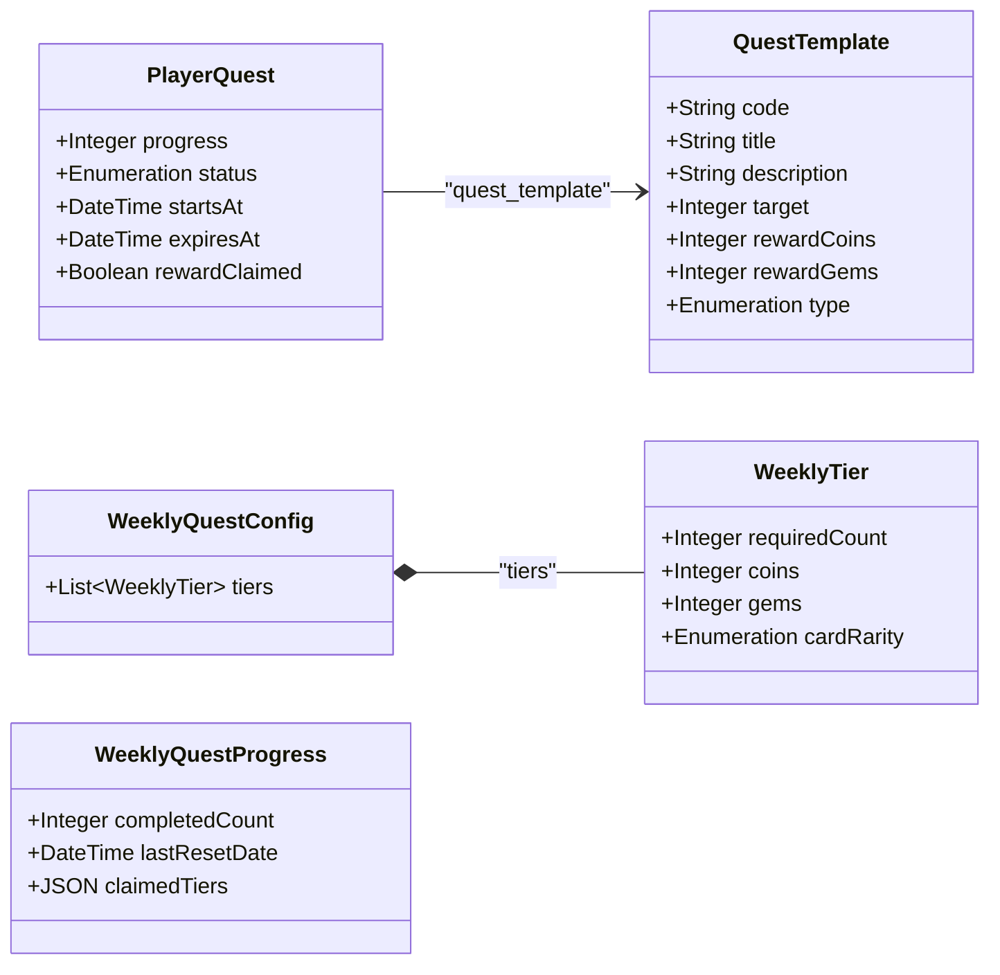

# Système de Quêtes Journalières & Hebdomadaires

Ce document détaille l'architecture, le fonctionnement technique, les modèles de données et le flux d'exécution du système de quêtes journalières et hebdomadaires du jeu Triple Triad (Terra Nullius). 

Il s'adresse aux développeurs et aux agents IA travaillant sur le projet.

---

## 1. Vue d'Ensemble

Le système de quêtes de Triple Triad est conçu pour être **entièrement découplé et piloté par les événements (event-driven)**. 

*   **Quêtes individuelles** : Les joueurs reçoivent des quêtes (ex: faire 3 parties, capturer 5 cartes) qui progressent au fur et à mesure de leurs actions.
*   **Système hebdomadaire** : Il ne s'agit pas de quêtes individuelles hebdomadaires, mais d'une **barre de progression cumulative**. Chaque fois qu'une quête journalière est complétée et réclamée par le joueur, le compteur hebdomadaire s'incrémente pour débloquer des paliers de récompenses (jalons/tiers).

---

## 2. Modèles de Données (Strapi 5)

Le backend (Strapi 5) s'appuie sur quatre collections principales et un composant réutilisable.



### A. Modèles de Quêtes individuelles

#### `Quest Template` (`api::quest-template.quest-template`)
*   **Description** : Représente le modèle de base d'une quête.
*   **Champs clés** :
    *   `code` (String, unique, requis) : Identifiant de programmation de la quête (ex: `PLAY_GAMES_DAILY`, `PLAY_FACTION_HEGEMONIE_MARTIENNE_DAILY`).
    *   `title` (String, requis) : Titre affiché à l'utilisateur.
    *   `description` (Text) : Description de l'objectif.
    *   `target` (Integer, requis, min 1) : Valeur cible à atteindre pour compléter la quête.
    *   `rewardCoins` / `rewardGems` (Integer, défaut 0) : Devises offertes.
    *   `type` (Enum, requis) : Types possibles : `daily`, `weekly`, `monthly`, `story`, `play_games`.

#### `Player Quest` (`api::player-quest.player-quest`)
*   **Description** : Instance de quête associée à un utilisateur spécifique.
*   **Champs clés** :
    *   `user` (Relation Many-to-One vers `users-permissions.user`) : Propriétaire de la quête.
    *   `quest_template` (Relation Many-to-One vers `api::quest-template.quest-template`) : Modèle associé.
    *   `progress` (Integer, requis, défaut 0) : Progression actuelle.
    *   `status` (Enum, requis, défaut `active`) : Statuts possibles : `active`, `completed`, `failed`.
    *   `startsAt` (DateTime, optionnel) : Date et heure à partir de laquelle le joueur peut progresser.
    *   `expiresAt` (DateTime, requis) : Date limite de complétion.
    *   `rewardClaimed` (Boolean, défaut `false`) : Indique si le joueur a récupéré ses gains.

---

### B. Modèles de Progression Hebdomadaire

#### `Weekly Quest Config` (`api::weekly-quest-config.weekly-quest-config` - Single Type)
*   **Description** : Contient la configuration globale des jalons hebdomadaires.
*   **Champs clés** :
    *   `tiers` (Component répétable `quest.weekly-tier`) : Liste des paliers ordonnés.

#### `Weekly Tier` (Composant `quest.weekly-tier`)
*   **Champs clés** :
    *   `requiredCount` (Integer, requis, min 1) : Nombre de quêtes journalières à réclamer pour débloquer le palier.
    *   `coins` (Integer, défaut 0) : Pièces d'or offertes.
    *   `gems` (Integer, défaut 0) : Gemmes offertes.
    *   `cardRarity` (Enum) : Rareté d'une carte tirée au sort (`None`, `Commun`, `Peu Commun`, `Rare`, `Épique`, `Légendaire`).

#### `Weekly Quest Progress` (`api::weekly-quest-progress.weekly-quest-progress`)
*   **Description** : Enregistre l'avancement d'un utilisateur pour la semaine courante.
*   **Champs clés** :
    *   `user` (Relation One-to-One vers `users-permissions.user`) : Utilisateur concerné.
    *   `completedCount` (Integer, requis, défaut 0) : Nombre de quêtes quotidiennes complétées et réclamées cette semaine.
    *   `lastResetDate` (DateTime, requis) : Lundi à 00:00:00 de la dernière semaine où la progression a été active/mise à jour.
    *   `claimedTiers` (JSON, optionnel) : Tableau d'entiers stockant les `requiredCount` des paliers déjà récupérés (ex : `[3, 5]`).

---

## 3. Cycle de Vie & Attribution des Quêtes

L'attribution des quêtes s'effectue via `back/strapi/src/api/player-quest/services/quest-assignment.ts` et la fonction `assignQuestsToUser(strapi, userId, immediate)`.

```
                    [Événement Joueur / Création]
                                 │
                     (Pruning: Nettoyage expiré)
                                 │
                   (Calcul: Quêtes manquantes ?)
                      (limite: maxQuestsPerUser)
                                 │
                   (Filtrage: Exclure déjà actives)
                                 │
                      (Attribution aléatoire)
                     /                       \
        Si immédiat (début)               Si différé (remplacement)
       startsAt = now                     startsAt = now + 22h
       expiresAt = fin de journée         expiresAt = fin de journée + 1
```

### A. Nettoyage et Remplissage (Pruning & Gap Filling)
À chaque exécution de `assignQuestsToUser` :
1.  **Suppression des quêtes expirées** : Le service recherche et supprime de la base de données toutes les `player-quests` du joueur dont le champ `expiresAt` est inférieur à l'heure courante (UTC).
2.  **Vérification de la limite** : Il compte les quêtes valides restantes. Si ce compte est inférieur à `maxQuestsPerUser` (configurable dans `game-config`, par défaut `5`), le système calcule le nombre de quêtes à attribuer (`questsNeeded`).
3.  **Sélection aléatoire unique** : Il extrait les modèles disponibles dans `quest-template` (en excluant `WELCOME_QUEST` et ceux déjà présents chez le joueur) puis pioche aléatoirement les quêtes manquantes.

### B. Le Cooldown des 22 Heures
Lorsqu'un joueur complète une quête, le système génère immédiatement sa remplaçante en base de données pour qu'il garde un nombre constant de quêtes dans sa liste.
Cependant, pour éviter le "grind" illimité, le paramètre `immediate` est positionné à `false` lors de ce remplacement :
*   **`startsAt`** : Est configuré à **+22 heures** à partir de l'heure courante.
*   **Statut visuel** : Le frontend détecte que `startsAt` est dans le futur et affiche la quête dans la section **"Prochaines quêtes"** (grisée, non progressionnable).
*   **Prise d'effet** : Dès que l'heure locale dépasse le `startsAt`, la quête bascule automatiquement dans les quêtes actives.

### C. Calculs de Dates d'Expiration (UTC)
*   **Quêtes Journalières** : Se terminent à la fin du jour de démarrage à 23:59:59.999 UTC.
    ```typescript
    const d = new Date(startsAt);
    d.setUTCHours(23, 59, 59, 999);
    expiresAt = d;
    ```
*   **Quêtes Hebdomadaires** : Se terminent le dimanche de la semaine de démarrage à 23:59:59.999 UTC.
    ```typescript
    const d = new Date(startsAt);
    const day = d.getUTCDay(); // 0 (Dimanche) à 6 (Samedi)
    const daysToSunday = day === 0 ? 0 : 7 - day;
    d.setUTCDate(d.getUTCDate() + daysToSunday);
    d.setUTCHours(23, 59, 59, 999);
    expiresAt = d;
    ```

---

## 4. Moteur d'Événements & Progression

La progression est gérée de manière transparente dans `back/strapi/src/api/player-event-log/services/event-logger.ts` via la fonction `logPlayerEvent(strapi, eventData)`.

### A. Mapping des Actions

Lorsqu'un événement survient, le système filtre les quêtes actives dont la date courante respecte `startsAt <= now <= expiresAt`, puis applique les règles de correspondance suivantes :

| Type d'événement (`eventType`) | Code de quête ciblé (`template.code`) | Logique additionnelle |
| :--- | :--- | :--- |
| `play_game` | `PLAY_GAMES` | Incrémente de 1 par partie jouée. |
| `win_game` | `WIN_GAMES` | Incrémente de 1 par victoire. |
| `open_booster` | `OPEN_BOOSTER` | Incrémente de 1 par paquet de cartes ouvert. |
| `capture_card` | `CAPTURE_CARDS` | Incrémente de 1 par carte capturée sur le plateau. |
| `play_card` | `PLAY_CARDS` | Incrémente de 1 par carte posée sur le plateau. |
| `play_card_element` | `PLAY_ELEMENT_[ELEMENT]` | Extrait le nom de l'élément du code et compare avec `relatedElement` en majuscules (ex: `EAU`, `LONGUE_PORTEE`). |
| `play_card_faction` | `PLAY_FACTION_[FACTION]` | Normalise la faction en supprimant les accents, remplaçant les espaces par des tirets bas, et compare (ex: `HEGEMONIE_MARTIENNE`). |

### B. Transition de Statut
Si la progression calculée est supérieure ou égale à `template.target` :
1.  Le statut passe à `completed`.
2.  Une nouvelle quête avec un cooldown de 22h (`immediate = false`) est créée en base de données pour occuper le slot futur.

---

## 5. Système Hebdomadaire & Lazy Reset

### A. Le "Lazy Reset" (Réinitialisation à la Demande)
Plutôt que d'avoir un script serveur (Cron) tournant à minuit tous les lundis et risquant de rater des utilisateurs ou de surcharger la base de données, la réinitialisation est **paresseuse**. 

À chaque fois qu'un utilisateur demande son statut de quête hebdomadaire, le service calcule le lundi de la semaine en cours :
```typescript
function getStartOfCurrentWeek() {
  const now = new Date();
  const day = now.getDay();
  // Calcule la différence pour caler le jour sur le lundi précédent
  const diff = now.getDate() - day + (day === 0 ? -6 : 1);
  const startOfWeek = new Date(now.setDate(diff));
  startOfWeek.setHours(0, 0, 0, 0);
  return startOfWeek;
}
```
Si `lastResetDate` enregistré chez le joueur est strictement inférieur à `startOfWeek` :
*   Le compteur `completedCount` est remis à `0`.
*   Le tableau des récompenses réclamées `claimedTiers` est vidé (`[]`).
*   `lastResetDate` est mis à jour à la valeur du lundi actuel.

### B. Distribution des Récompenses et Tirage Aléatoire
Lors de la réclamation d'un palier hebdomadaire via `/api/weekly-quest/claim` :
1.  Vérification de la validité de la demande (compteur suffisant et palier non réclamé).
2.  Crédit immédiat des devises (`coins` et `gems`).
3.  **Attribution de la carte aléatoire** par rareté (`cardRarity`) :
    *   Le système cherche toutes les cartes correspondant à cette rareté.
    *   *Mécanisme de secours* : Si aucun champ direct de rareté n'est configuré en base de données, le code calcule la rareté de chaque carte de manière dynamique d'après la somme de ses 4 valeurs :
        *   **Commun** : Somme < 20
        *   **Peu Commun** : 20 <= Somme < 26
        *   **Rare** : 26 <= Somme < 32
        *   **Épique** : 32 <= Somme < 36
        *   **Légendaire** : Somme >= 36
    *   Une carte est choisie au hasard dans ce groupe et est injectée dans la collection du joueur (`api::user-card.user-card`).

---

## 6. Endpoints de l'API (Strapi 5)

| Méthode | Route | Rôle | Paramètres (Body / Path) |
| :--- | :--- | :--- | :--- |
| **GET** | `/api/player-quests` | Récupère toutes les quêtes (actives, complétées, futures) du joueur connecté. | *Aucun* |
| **POST** | `/api/player-quests/:id/claimReward` | Réclame la récompense d'une quête complétée. Incrémente le compteur hebdomadaire si la quête est de type `daily`. | `:id` (documentId de la quête) |
| **GET** | `/api/weekly-quest/config` | Récupère les configurations des paliers (tiers) définis sur le serveur. | *Aucun* |
| **GET** | `/api/weekly-quest/progress` | Récupère la progression hebdomadaire du joueur (déclenche le Lazy Reset si besoin). | *Aucun* |
| **POST** | `/api/weekly-quest/claim` | Réclame les récompenses d'un palier de quête hebdomadaire. | `requiredCount` (Palier à réclamer) |

---

## 7. Guide & Bonnes Pratiques pour le Développement et l'IA

> [!IMPORTANT]
> **Règle d'Or du Statut**  
> Toujours utiliser le statut `"active"` (et non `"in_progress"`) pour les quêtes en cours. Une standardisation a été opérée pour aligner le frontend et le backend.

> [!TIP]
> **Populate Obligatoire**  
> Lors de la manipulation ou du requêtage des `player-quests`, veillez à toujours peupler la relation `quest_template`. Sans cela, les calculs de progression évènementielle (`event-logger`) et de réclamation échoueront.

> [!WARNING]
> **Date de démarrage (`startsAt`)**  
> Les quêtes futures ont un `startsAt` dans le futur. Ne progressez jamais une quête si `startsAt` n'est pas encore dépassé par la date actuelle. Les requêtes de filtre dans `event-logger.ts` excluent explicitement ces quêtes.

---

### Résumé des Fichiers Clés

*   **Backend** :
    *   Service d'attribution : `back/strapi/src/api/player-quest/services/quest-assignment.ts`
    *   Moteur de progression : `back/strapi/src/api/player-event-log/services/event-logger.ts`
    *   Gestion du reset et de l'incrément hebdo : `back/strapi/src/api/weekly-quest-progress/services/weekly-quest-progress.ts`
    *   Contrôleur de réclamation hebdo : `back/strapi/src/api/weekly-quest-progress/controllers/weekly-quest-progress.ts`
*   **Frontend** :
    *   Affichage principal : `front/src/views/QuestsPage.vue`
    *   Composant Barre de progression : `front/src/components/WeeklyQuestProgress.vue`
    *   Store Pinia : `front/src/stores/userStore.js` (méthodes `fetchUserQuests`, `fetchWeeklyQuests`, `claimWeeklyTier`, `claimQuestReward`).
