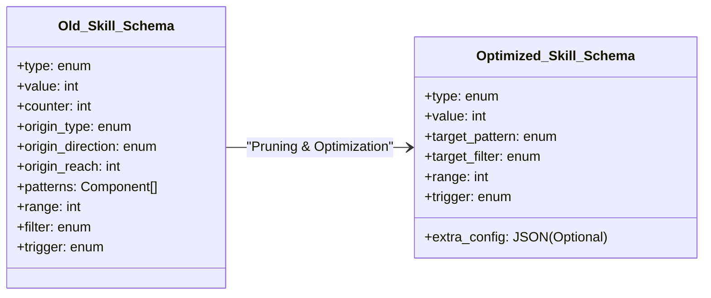

# Analyse et Critique de l'Architecture des Skills & Schéma BDD

Ce document propose une analyse approfondie de la mécanique actuelle des compétences (skills) dans le projet *Terra Nullius*, de leur modélisation dans la base de données PostgreSQL via Strapi 5, et formule des critiques et contre-propositions pour simplifier le système en éliminant le superflu.

---

## 1. Analyse de l'Existant (Statut Actuel)

### Le Schéma de Base de Données (Strapi 5)
Chaque compétence est un composant Strapi (`game.skill`) composé des colonnes suivantes :

| Champ | Type | Description | Rôle Technique |
| :--- | :--- | :--- | :--- |
| `type` | Enumeration | ID du skill (ex: `growing`, `death`, `bomb`...) | Détermine quel handler JS exécuter. |
| `value` | Integer | Valeur numérique | Montant de dégâts, de soin ou de bonus. |
| `counter` | Integer | Nombre d'utilisations | Limite de charges de la compétence. |
| `origin_type` | Enumeration | `self`, `fixed`, `manual`, `manual_constrained` | Origine de la zone d'effet (AoE). |
| `origin_direction`| Enumeration | `top`, `bottom`, `left`... | Direction pour l'origine décalée (`fixed`). |
| `origin_reach` | Integer | Distance | Distance de décalage ou rayon maximal. |
| `patterns` | Component (rep) | `game.skill-pattern` (Enum) | Liste répétable de motifs de ciblage (adjacent...). |
| `range` | Integer | Portée | Profondeur de propagation des motifs. |
| `filter` | Enumeration | `none`, `allies`, `enemies`, `empty`, `self` | Restriction des cibles finales. |
| `trigger` | Enumeration | `onEnterPlay`, `onEndOfTurn`, `onDeath`... | Événement déclencheur du skill. |

---

## 2. Critiques Principales (Le Superflu et les Problèmes)

### Critique A : Le Paradoxe du Ciblage Généralisé vs Hardcodé
Le schéma tente de bâtir un moteur de ciblage géométrique extrêmement abstrait et ultra-générique (mélangeant des origines relatives, des décalages, de la portée, et des listes répétables de motifs). 

**Pourtant, dans la pratique :**
1. **La majorité des compétences ignorent ou contournent ce système** :
   * Le skill `death` (Mort) ignore `patterns`, `range` et `filter`. Il boucle directement en dur sur les 4 directions cardinales (`DIRECTIONS_4`).
   * Le skill `turn` (Rotation) utilise uniquement `value` pour le sens de rotation et n'a cure des filtres géométriques.
   * Les passifs comme `aura`, `freeze`, `combo` et `ward` n'utilisent absolument aucun calcul de cellule cible issu du schéma BDD.
2. **Complexité inutile** : Porter des colonnes comme `origin_direction` ou `origin_reach` pour **tous** les skills alourdit l'interface d'édition Strapi pour les Game Designers et ajoute du bruit dans les payloads API.

### Critique B : L'impact SQL désastreux du composant répétable `patterns`
Dans Strapi 5, le champ `patterns` est un composant **répétable** pointant vers `game.skill-pattern` (qui ne contient lui-même qu'une seule énumération). 
* **Au niveau BDD (PostgreSQL)** : Cela génère une table de liaison (`components_game_skills_patterns_links`) et une table de composants distincte. 
* **Conséquence** : Chaque chargement de carte avec compétence effectue des jointures SQL multiples lourdes (requêtes N+1 potentielles lors des sélections massives) pour simplement récupérer une chaîne comme `"adjacent"`. C'est un gâchis de performance pour un besoin où 99% des skills n'utilisent qu'un seul motif à la fois.

### Critique C : Le champ fantôme (`counter`)
Le champ `counter` (Compteur d'utilisations) est configuré dans la BDD et affiché sur l'UI (`CardDetailModal.vue` sous la forme `(3x)`).
* **Cependant, le code du moteur de jeu ne l'utilise JAMAIS** : Il n'y a aucun endroit dans `GameEngine.ts` ni `engine.js` qui décrémente ce compteur, qui vérifie s'il est supérieur à 0, ou qui désactive le skill lorsque le compteur tombe à zéro. C'est actuellement une colonne morte.

### Critique D : Incohérences de configuration des Triggers
Le système permet de sélectionner **n'importe quel trigger pour n'importe quel skill**.
* **Problème** : Configurer une compétence comme `bomb` avec un trigger `passive` ou `onDrawn` (au lieu de `onDeath`) va briser le comportement ou ne rien faire, car le code de `bomb.ts` s'attend à être exécuté au moment où la carte meurt. La liberté accordée par l'interface d'administration Strapi favorise les erreurs humaines de configuration.

---

## 3. Contre-Propositions (Simplifier et Clarifier)

Pour alléger la structure de données et rendre le code 100% cohérent, voici les étapes d'une architecture épurée :



### Contre-Proposition 1 : Aplatir et Simplifier le Ciblage (Zéro Jointure)
Supprimer le composant répétable `patterns`, ainsi que la triade complexe `origin_type`/`origin_direction`/`origin_reach`. Remplacer le tout par un modèle de ciblage **plat et direct** dans le composant `game.skill` :

1. **`target_pattern` (Enum)** : `self`, `adjacent`, `cross`, `diagonals`, `row`, `column`, `all`. (Un seul choix direct, pas de table SQL liée).
2. **`target_filter` (Enum)** : `none`, `allies`, `enemies`, `empty`, `self`.
3. **`range` (Integer, default: 1)** : Portée de diffusion.

> [!TIP]
> **Pourquoi c'est mieux ?**
> Plus besoin de tables de jointures SQL ! Le payload JSON devient extrêmement compact et lisible, et l'interface d'édition Strapi devient instantanément limpide.

### Contre-Proposition 2 : Utiliser un champ `extra_config` (JSON) pour les cas exotiques
Si un skill très rare (comme une téléportation spécifique) a besoin de paramètres complexes (comme un décalage ou une coordonnée fixe), au lieu de polluer le schéma global, on ajoute une unique colonne optionnelle de type **JSON** : `extra_config`.
* Exemple pour une téléportation avec décalage : `extra_config = { "dx": 1, "dy": -1 }`.

### Contre-Proposition 3 : Assainir ou Activer le champ `counter`
* **Option A (Élaguer)** : Si la mécanique de charges n'est pas prévue à court terme, supprimer complètement le champ `counter` de la BDD et de l'UI pour épurer le code.
* **Option B (Valoriser)** : Si on le garde, implémenter sa décrémentation dans le `SkillRegistry` :
  ```typescript
  if (skill.counter !== undefined && skill.counter > 0) {
      skill.counter--;
      // Si counter tombe à 0, on peut désactiver ou détruire le skill de la carte
  }
  ```

### Contre-Proposition 4 : Rendre le ciblage "Moteur" et non plus "Code"
Pour les skills comme `death.ts` ou `heal.ts` qui recalculent leur zone à la main, **les forcer à consommer la zone d'effet calculée par `getTargetCells`**.
* Exemple pour `death.ts` épuré :
  ```typescript
  execute(ctx: any) {
    const { skill, alerts } = ctx;
    const targets = getTargetCells(ctx); // Fait confiance au ciblage configuré en BDD !
    
    for (const { x, y, cell } of targets) {
      if (cell) {
        // Applique les dégâts
      }
    }
  }
  ```
  Cela unifie le comportement de tous les skills actifs et rend le moteur 100% modulaire.

---

## 4. Plan de Migration Suggéré

Si l'équipe valide cette restructuration, voici la marche à suivre :

1. **Sauvegarde des données** : Exécuter `npm run backup` pour geler l'état actuel de Strapi.
2. **Mise à jour des schémas Strapi** :
   * Modifier `back/strapi/src/components/game/skill.json` pour supprimer les champs superflus et introduire `target_pattern`, `target_filter` et `extra_config`.
   * Supprimer le composant `skill-pattern.json`.
3. **Mise à jour du code partagé** :
   * Adapter `shared/skills/helpers.ts` (`getTargetCells`) pour consommer les nouveaux attributs plats.
   * Réfracter les skill handlers (`death.ts`, `heal.ts`...) pour exploiter systématiquement `getTargetCells`.
4. **Script de migration de données** : Écrire un petit script JS pour convertir les anciennes cartes dans la BDD PostgreSQL vers le nouveau format plat.
